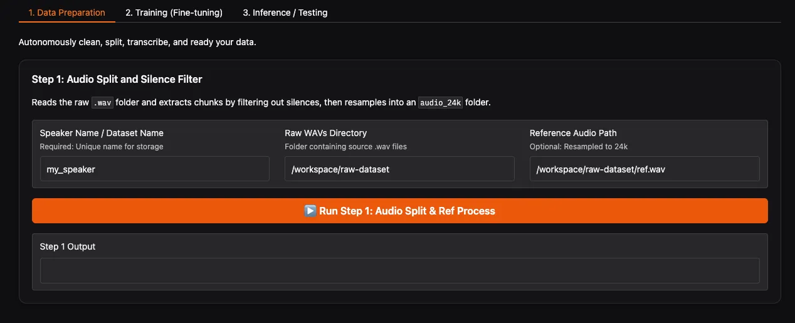
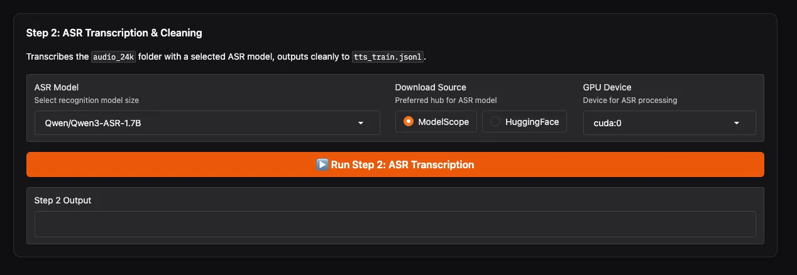
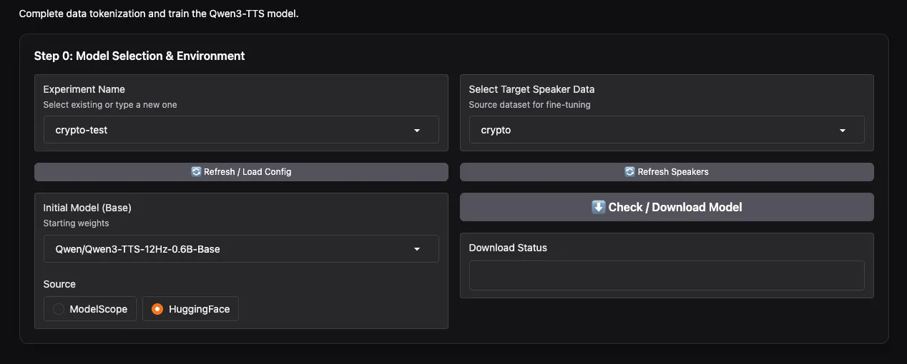
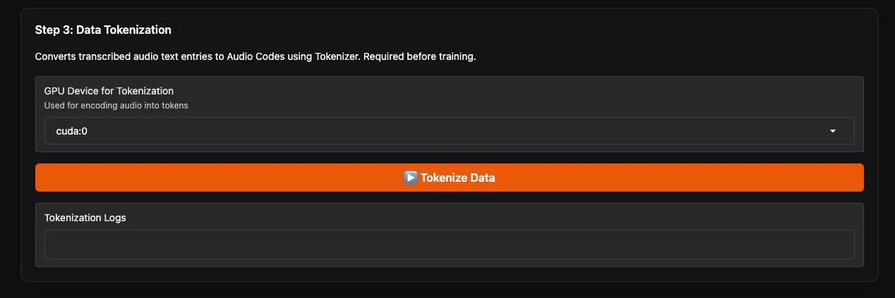
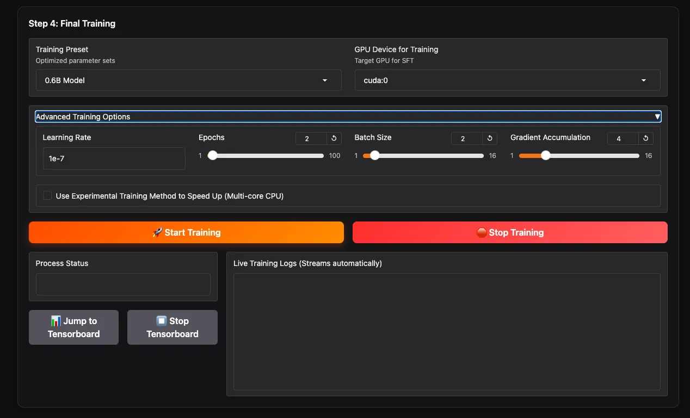
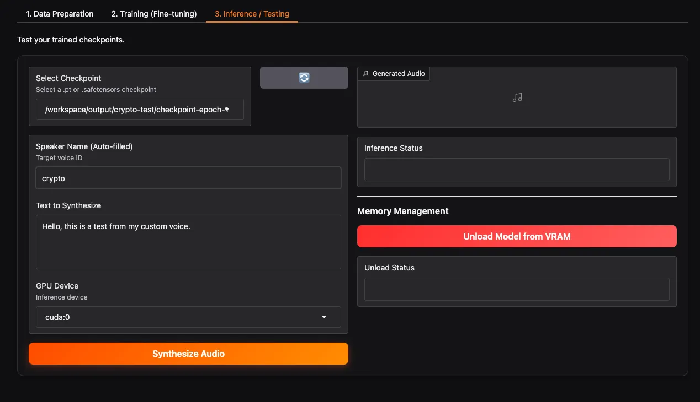

> 想让 AI 用你的声音朗读小说？想为视频角色定制专属音色？  
> 本文将手把手教你使用 **Qwen3-TTS Easy Finetuning** 工具，通过微调打造一个稳定、自然、跨语言无口音的专属语音模型。

---

Read this article in English: [Qwen3-TTS Fine-tuning Complete Guide: Train Your Own Voice Model from Scratch](/article/qwen3-tts-finetuning-en)

## 为什么你需要微调，而不是仅仅用零样本克隆？

最近 AI 语音克隆非常火爆，你或许听说过“只需几秒钟音频就能克隆任何人的声音”。这种技术叫 **零样本语音克隆（Zero-shot TTS）**，确实方便快捷。但它有一个致命缺陷：**稳定性差**。同一句话生成两次，音色可能忽远忽近；说不同句子时，声音甚至会“飘”成另一个人。

尽管Qwen3-TTS的零样本克隆效果已经很不错了，能避免以上很多问题，但是还是存在一些不足，比如：

- 跨语言带有母语口音
- 语调不够自然
- 情感表达不够丰富

如果你只是想随便玩玩，零样本克隆或许够用。但如果你希望：

- 用固定的声音长期制作视频、播客；
- 让角色在不同场景下保持一致的语调；
- 用中文说话人的模型说英文，听起来像地道老外；

那么你需要的是 **微调（Fine-tuning）**。

微调相当于让 AI 深度学习目标说话人的所有发音细节，最终得到一个 **单说话人模型** —— 它只擅长模仿这一个声音，但能做到 **极其稳定、自然，并且能理解自然语言中的情绪和语速指示**（比如“用悲伤的语气说”、“加快语速”）。

> ⚠️ **重要提示**：微调后的模型不再是“克隆模型”，而是一个**固定的声音模型**。它无法像零样本克隆那样随时切换成另一个人。如果你需要多角色配音，可以针对每个角色分别微调一个模型，然后切换使用。

好消息是，本项目现已领先官方，**抢先支持多说话人同时微调**！你可以一次性地、更高效地为多个角色定制声音模型。

---

## 什么是 Qwen3-TTS Easy Finetuning？

这是我开发的一个开箱即用的工具包，基于阿里巴巴通义实验室最新开源的 **Qwen3-TTS** 模型，帮你省去代码编写和环境配置的烦恼，通过图形化界面（WebUI）或简单命令，就能完成从原始音频到专属语音模型的全部流程。

- **一键式操作**：音频分割、自动转录（ASR）、数据清洗、编码、训练，全流程自动化。
- **现代化 WebUI**：基于 Gradio 构建，操作直观，实时显示进度。
- **内置优化配置**：针对 0.6B 和 1.7B 两种模型大小，提供已验证的训练参数。
- **Docker 支持**：一键启动，无需手动安装依赖。

---

## 准备工作：你需要什么？

- 一台带有 **NVIDIA GPU** 的电脑（建议显存 ≥ 8GB，微调 1.7B 模型需要 ≥ 16GB。作者本人使用单张3080 10G进行训练）
- 目标说话人的 **纯净录音**（建议 10～30 分钟，wav 格式，背景噪音越小越好）
- 基本的命令行操作能力（会复制粘贴即可）
- （可选）对 Docker 的了解，或者直接使用 Python 虚拟环境

---

## 第一步：安装与启动

### 方法一：使用 Docker（推荐，最快速、最稳妥）

```bash
# 克隆仓库
git clone https://github.com/mozi1924/Qwen3-TTS-EasyFinetuning.git
cd Qwen3-TTS-EasyFinetuning

# 启动容器
docker compose up -d
```

如果你是大陆用户，可以使用以下命令从国内镜像源加速下载：
```bash
DOCKER_IMAGE=registry.cn-hangzhou.aliyuncs.com/mozi1924/qwen3-tts-easyfinetuning:latest docker compose up -d
```

第一次启动会自动下载镜像（约 10GB），稍等片刻。看到显示绿色的 `Started` 则代表程序启动成功。不过WebUI需要约30秒的预热时间。成功后，打开浏览器访问 `http://localhost:7860`。如果你是在局域网的其他机器上访问，请将 `localhost` 替换为部署机器的IP地址。

### 方法二：使用 Python 虚拟环境（适合开发者）

```bash
# 克隆仓库
git clone https://github.com/mozi1924/Qwen3-TTS-EasyFinetuning.git
cd Qwen3-TTS-EasyFinetuning

# 创建虚拟环境
python -m venv venv
source venv/bin/activate  # Linux/Mac
# venv\Scripts\activate   # Windows

# 安装依赖
pip install -r requirements.txt
pip install flash-attn==2.8.3 --no-build-isolation  # 可选，加速训练

# 启动 WebUI
python src/webui.py
```

启动后同样访问 `http://localhost:7860`。

---

## 第二步：准备你的数据

这是至关重要的一步。请将你的原始音频文件（`.wav`格式）按照以下结构放入项目目录下的 `raw-dataset` 文件夹中：

```
raw-dataset
├─ speaker_1            # 说话人1的文件夹
│ ├── 0001.wav          # 音频文件，建议一句话一个文件
│ ├── 0002.wav
│ ├── 0003.wav
│ └── ref.wav           # ⭐ 必须的参考音频
├─ speaker_2            # 说话人2的文件夹（用于多说话人训练）
│ ├── 0001.wav
│ ├── 0002.wav
│ ├── 0003.wav
│ └── ref.wav           # ⭐ 每个说话人都有自己的参考音频
.....
```

**关于 `ref.wav` 的重要说明**：
- `ref.wav` 是**必须的**，它将被固化在模型中，作为音色、语气和语速的稳定参考，确保推理效果一致。
- 你可以从该说话人的训练数据中选择一段你认为质量最高的音频。
- **时长建议控制在 3-10 秒**，最短不要低于3秒，最长不要超过10秒。

---

## 第三步：使用 WebUI 进行微调（图文详解）

WebUI 分为三个主要标签页，我们一步步操作。

### 📁 标签页 1：数据准备（Data Preparation）

#### 1.1 刷新路径并运行 Step 1：音频分割



在 WebUI 中：

- 点击 **Refresh Paths** 按钮。系统会自动识别 `raw-dataset` 下的文件夹和 `ref.wav`。
- 确认 **Raw WAVs Directory** 下拉框中出现了你的数据集文件夹（如 `speaker_1`）。
- **Reference Audio Path** 会自动填充为对应文件夹下的 `ref.wav`，无需手动修改。
- 点击 **Run Step 1**。

这一步CPU消耗较大，建议关闭后台其他软件，避免电脑卡死。程序会分析音频，自动切除静音片段，将长音频切分为短句，并统一采样率为 24kHz。完成后，你会在 `final-dataset/speaker_1/audio_24k/` 看到处理好的音频片段。

#### 1.2 运行 Step 2：ASR 转录与二次清理



这一步用 ASR 模型自动识别每个音频片段的内容，生成文本标注，并进行二次清理。

- **ASR Model**：**强烈推荐**选择 `Qwen/Qwen3-ASR-1.7B`，识别最准确。
- **Download Source**：如果你在中国大陆，选择 **ModelScope** 可获得最快下载速度；海外用户可选 HuggingFace。
- **GPU Device**：选择用于 ASR 的 GPU（如 `cuda:0`）。
- 点击 **Run Step 2**。

等待进度条走完，你会得到 `final-dataset/speaker_1/tts_train.jsonl`，每一行是 `{"audio": "路径", "text": "识别出的文字"}`。完成后WebUI会有提示。

---

### 🏋️ 标签页 2：训练（Training）

#### 2.1 新建实验并选择数据（Step 0）



- **Experiment Name**：输入一个名字，例如 `my_first_voice`，然后点击 **Create New Experiment**。
- **Select Target Speaker Data**：在下拉框中**选择你要进行微调的说话人**。得益于新功能，你可以在这里**多选**，实现多说话人同时训练！
- **Initial Model**：选择基础模型。视频作者推荐 **0.6B 的模型**，认为完全够用。你也可以根据需要选择 `1.7B`。
- **Download Source**：同样，根据你的网络环境选择 ModelScope 或 HuggingFace。
- 点击 **Check / Download Model** 预先下载基础模型。

#### 2.2 运行 Step 3：数据 Tokenization



- **GPU Device for Tokenization**：选择用于此步骤的 GPU。
- 点击 **Tokenize Data**。

这一步会合并你选择的多个说话人数据，并使用 Qwen3-TTS 的专用 Tokenizer 将音频转换为离散编码，输出 `tts_train_with_codes.jsonl`，这是最终用于训练的文件。操作完成后会有进度条提示。

#### 2.3 设置训练参数并开始训练（Step 4: Final Training）



- **Training Preset**：根据你选择的模型大小（0.6B / 1.7B）选择对应的训练预设。这些是经过社区验证的、比较保守的参数。
- **Advanced Training Options**：如果你希望自定义，可以展开此项手动调整 `batch_size`、`learning_rate` 等参数。
- **GPU Device for Training**：选择训练用的 GPU。
- 点击黄色的 **Start Training** 开始训练。

你可以在下方的进度条上实时查看训练信息，如 `epoch`、`step` 和 `loss` 值。如果你更专业，也可以点击 **Jump to Tensorboard** 查看详细的统计图表。

训练时长取决于数据量和模型大小。一般 10～30 分钟音频，在 10GB 显存上训练 0.6B 模型 2～3 个 epoch 大约需要 1～2 小时。

训练完成后，模型检查点会保存在 `output/my_first_voice/` 目录下。

---

### 🎧 标签页 3：推理测试（Inference）

#### 3.1 加载检查点并生成语音



- **Select Checkpoint**：点击刷新按钮，然后从下拉列表中选择你刚刚训练好的检查点文件夹（例如 `checkpoint-epoch-2`）。
- **Select Speaker**：选择你想要测试的说话人。
- **Text to Synthesize**：输入你想测试的文本，可以是中文、英文或混合。
- **GPU Device**：选择推理用的 GPU。
- 点击 **Synthesize Audio**，稍等片刻，下方会播放生成的语音。如果效果满意，恭喜你，你的专属语音模型诞生了！

更多高级功能和选项，可以自行探索工作目录和WebUI界面。

---

## 进阶技巧：如何让模型效果更好？

- **数据质量 > 数据量**：10 分钟干净、情感丰富的录音，远胜于 1 小时嘈杂的录音。
- **避免背景音乐**：ASR 转录会受音乐干扰，导致文本错误。
- **适当增加 epoch**：如果声音不像，可以尝试增加到 5～10 个 epoch，但要注意过拟合（声音僵硬）。
- **调整学习率**：预设学习率通常合适，如果 loss 震荡，可以适当降低。

---

## 常见问题

**Q：我没有 GPU，能用 CPU 训练吗？**  
A：可以，但极其缓慢（可能训练一个模型需要几天）。建议使用云 GPU 实例，如 AutoDL、Colab 等。

**Q：训练时显存不足怎么办？**  
A：减小 `batch_size`，增加 `gradient_accumulation_steps`，或者换用 0.6B 模型。

**Q：我只有 1 分钟音频，能微调吗？**  
A：可以，但效果可能不稳定。建议至少收集 5 分钟以上。

**Q：微调后还能零样本克隆其他人吗？**  
A：不能。微调后的模型专属于你训练的说话人。若需多角色，请使用本工具的多说话人微调功能，或者分别微调多个模型。

**Q：生成的语音有电流声/杂音？**  
A：检查原始音频质量，训练数据中不要有底噪。可以在 Step 1 之前先用 UVR5 等工具降噪。

---

## 结语

通过本文的指导，你应该已经掌握了如何使用 Qwen3-TTS Easy Finetuning 微调自己的语音模型。这个工具将复杂的 AI 训练流程封装成简单的几步，让每个人都能拥有属于自己的 AI 声音。

如果你在操作中遇到任何问题，欢迎在 GitHub 仓库提交 Issue。也欢迎你分享微调后的成果！和社区分享你的经验，共同进步。

> **项目地址**：[https://github.com/mozi1924/Qwen3-TTS-EasyFinetuning](https://github.com/mozi1924/Qwen3-TTS-EasyFinetuning)

---

## ⭐ Star History

[](https://www.star-history.com/#mozi1924/Qwen3-TTS-EasyFinetuning&type=date&legend=top-left)

---