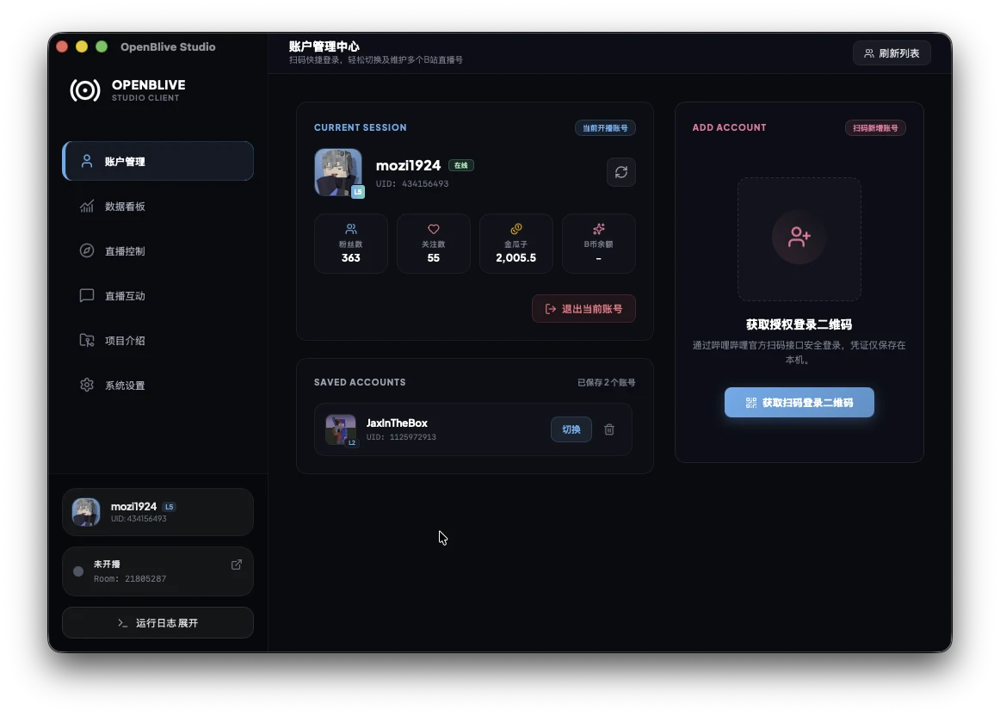
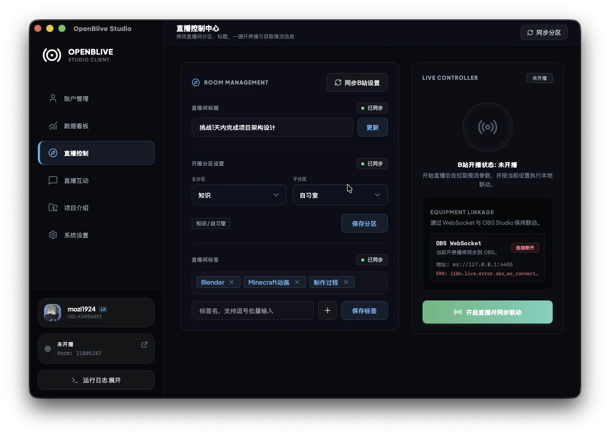
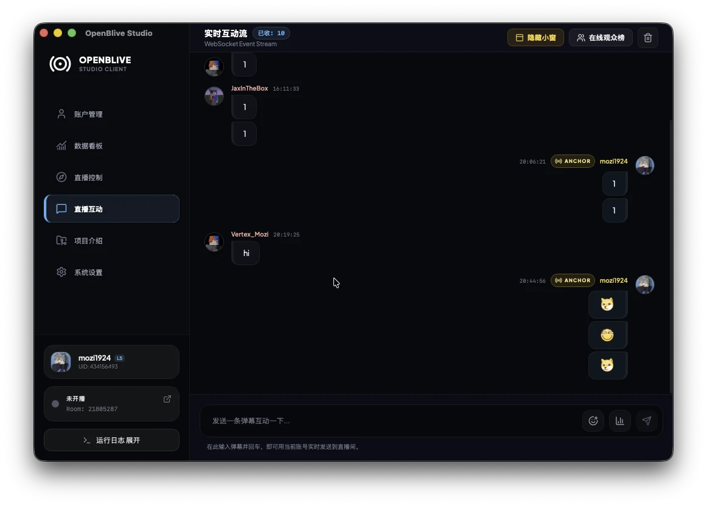
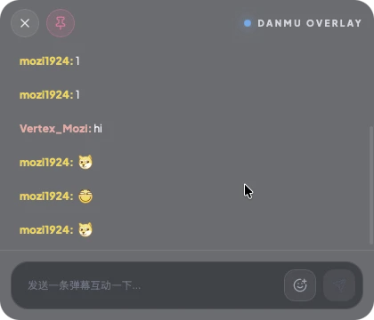

## 前言

最近我一直在做一个我自己真会拿来用的项目：`OpenBLive Studio`。

起因其实很直接。B 站开播这件事，Windows 用户一直有相对成熟的官方工具，但如果你平时主要用的是 macOS 或 Linux，很多流程不是缺失，就是要靠各种绕路方案才能勉强拼起来。  
我想做的，就是把这段体验补齐：给非 Windows 用户一个更轻、更直接、更清爽的桌面端开播助手。

## OpenBLive Studio 是什么

`OpenBLive Studio` 是一个面向 B 站主播的第三方桌面开播工具，使用 `Tauri v2 + React 19` 构建，目标不是替代一切现有工具，而是把“登录账号、配置直播间、拿到推流信息、开始互动”这些最核心的流程整理得更顺手一些。

它现在已经能在 `Mac / Linux / Windows` 三个平台上构建和发布，也顺手补上了 Linux/macOS 用户在 B 站开播工具上的一块空白。

## 我最在意的两个点

第一，是跨平台。

我不希望这个项目天然把一部分创作者排除在外。无论你是在 MacBook 上准备内容、在 Linux 工作站上做开发，还是仍然使用 Windows 作为主力直播环境，`OpenBLive Studio` 都应该尽量提供一致的桌面体验。

第二，是和 `OBS` 的配合方式。

`OpenBLive Studio` 支持配合 `OBS` 完成 `RTMP` 推流开播，并提供 `OBS WebSocket` 联动能力。换句话说，它负责把 B 站侧的开播流程、房间信息和联动控制整理好，而真正的视频采集、场景编排和推流仍然交给 OBS 这类成熟工具去完成。  
这也是我想要的边界感：它不是“内置 OBS”，也不是“完全替代 OBS”，而是把两边更自然地接起来。

## 现在已经有的功能

目前这版已经覆盖了我自己比较在意的几条主线：

- 支持扫码登录、保存多个 Bilibili 账号并快速切换
- 支持同步直播间信息，编辑标题、分区、标签，并获取推流地址和推流码
- 支持一键开播 / 下播，以及和 `OBS WebSocket`、Shell Command 做联动
- 支持实时接收弹幕、礼物、进场等消息，也能快捷发送弹幕和房间表情
- 内置独立弹幕小窗，适合在直播时单独悬浮查看
- 提供直播数据看板，方便回看最近场次的整体表现
- 开放了内置 `HTTP + WebSocket` 服务，同时兼容 blivechat 风格的 Overlay 接入

这些能力放在一起之后，它更像一个偏轻量的“桌面开播控制台”，而不只是一个单独的登录器或者弹幕查看器。

## 一些界面截图

先从账号管理开始。多账号切换、扫码登录和当前开播账号状态，都集中在首页里。

开播控制页是我最想做顺手的地方。这里可以同步直播间资料、设置标题和分区、保存标签，并在需要时和 OBS 联动，直接进入 RTMP 开播流程。

直播开始之后，互动页会持续接收直播间里的实时消息。对我来说，这一页的重点不是“消息很多”，而是消息流、快捷操作和状态反馈要足够直观。

如果你不想一直把主窗口停在前台，也可以直接使用独立弹幕小窗。这个模式我自己很喜欢，因为它更接近真正直播时的使用习惯。

## 下载、试用与反馈

如果你也正好在找一个跨平台的 B 站桌面开播工具，可以直接看看项目：

- 仓库首页：[mozi1924/openblive](https://github.com/mozi1924/openblive)
- 下载页面：[GitHub Releases](https://github.com/mozi1924/openblive/releases)

如果你正在使用 macOS、Linux，或者也希望把 B 站开播流程和 OBS 配得更顺一点，也很欢迎你去试试，然后告诉我哪些地方还不够好用。这个项目现在还在持续迭代里，我也很期待把它继续打磨下去。
