# Rig2 Remake System Flowcharts

## 1. 总体分层图

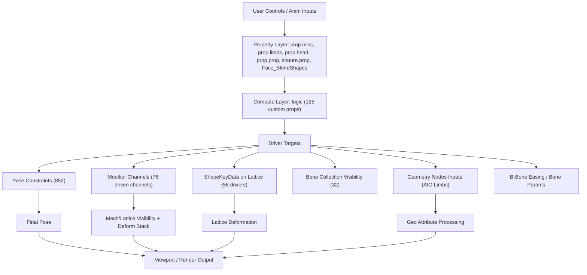

## 2. 属性总线与驱动求值

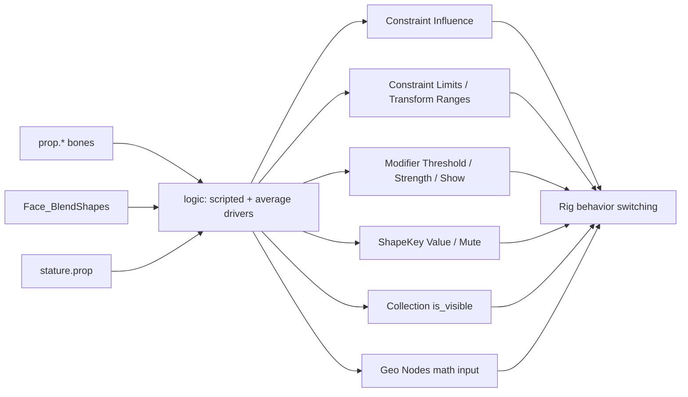

## 3. 四肢模式切换（IK / FK / Fancy / MI）

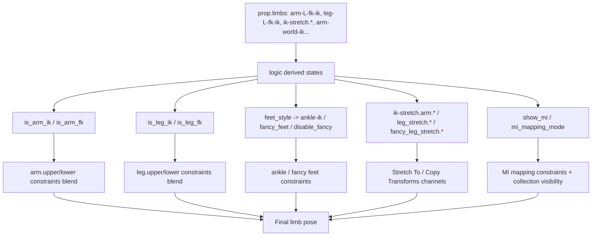

## 4. Lattice + ShapeKey 修正链

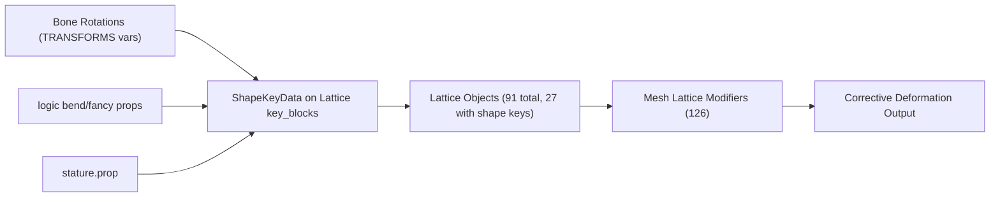

## 5. Curve + Hook + Spline IK 柔性链

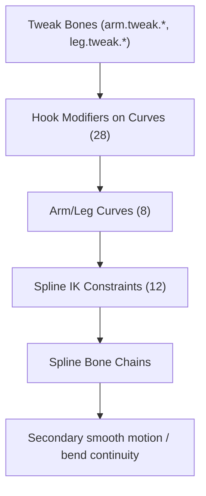

## 6. 面部系统（Face_BlendShapes -> 约束网络）

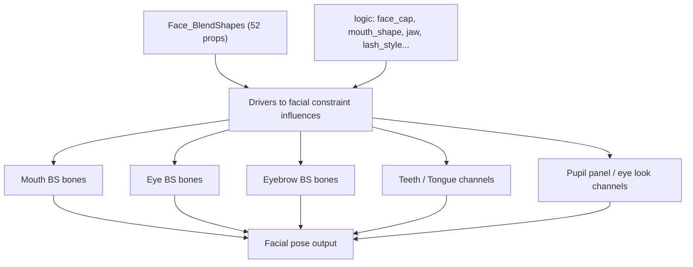

## 7. Geometry Nodes 链路（AIO Limbs）

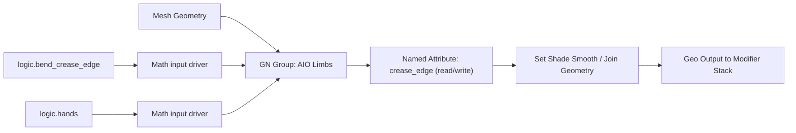

## 8. 可见性与控制器 UI 自动切换

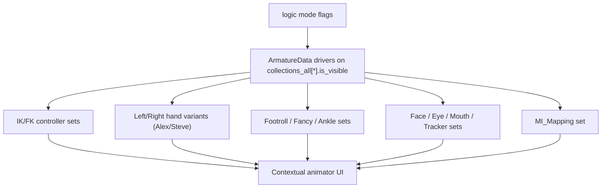

## 9. 驱动类型图（实现策略）

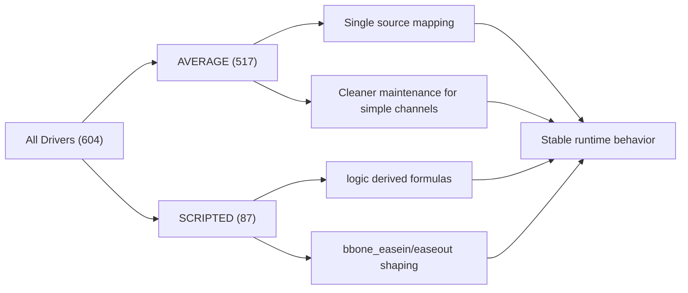

## 10. AIO 材质节点图谱（rig2_material）

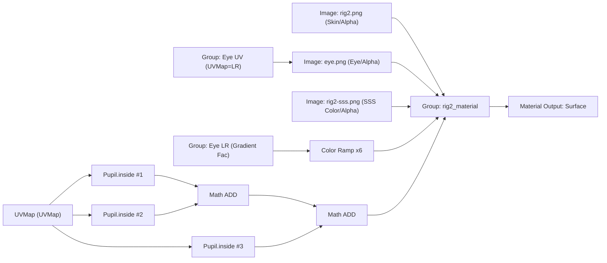

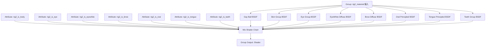

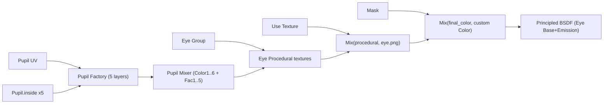
